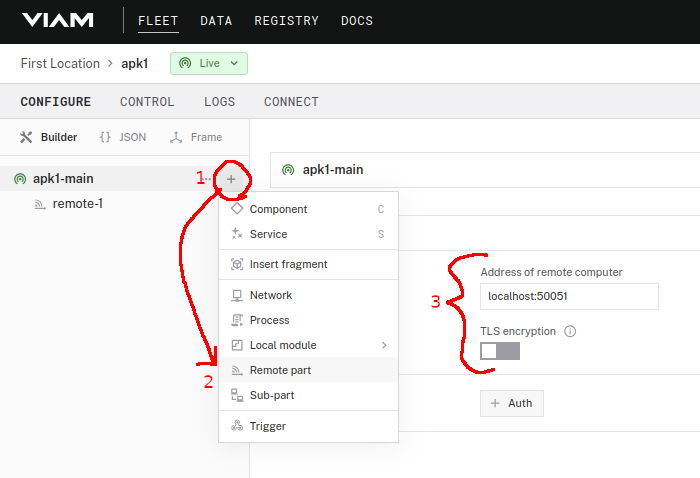
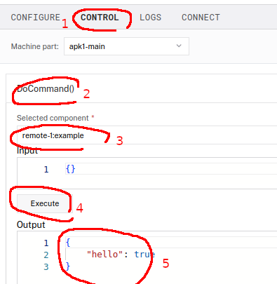

# Remote part example

## Setup instructions

Install the app on the same device as your RDK-APK.

Then in the builder:

1. '+' menu
2. Remote part
3. use `localhost:50051` to match the hardcoded port



To test this:

1. Control tab
2. Open DoCommand
3. select your remote part in the dropdown
4. Execute
5. You should see output



Note: this was tested on Android 10, permissions / other things may be different on 11+.

## Troubleshooting

In Viam webapp logs, a successful connection looks like:

```log
7/22/2024, 3:28:45 PM info robot_server impl/resource_manager.go:852 Connected now to remote remote remote-1
7/22/2024, 3:28:45 PM info robot_server.rdk:remote:/remote-1 client/client.go:333 successfully (re)connected to remote at address address localhost:50051
7/22/2024, 3:28:45 PM warn robot_server.rdk:remote:/remote-1.webrtc rpc/dialer.go:265 downgrading from TLS to plaintext address localhost:50051
7/22/2024, 3:28:45 PM info robot_server impl/resource_manager.go:840 Connecting now to remote remote remote-1
7/22/2024, 3:28:45 PM info robot_server impl/resource_manager.go:728 Now configuring a remote resource rdk:remote:/remote-1
7/22/2024, 3:28:45 PM info robot_server impl/local_robot.go:1232 (Re)configuring robot
```
